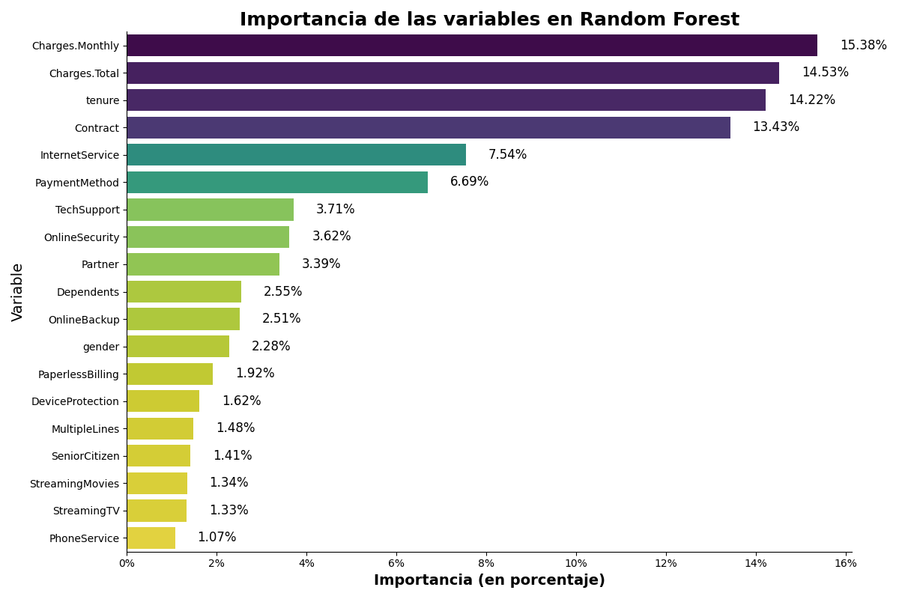
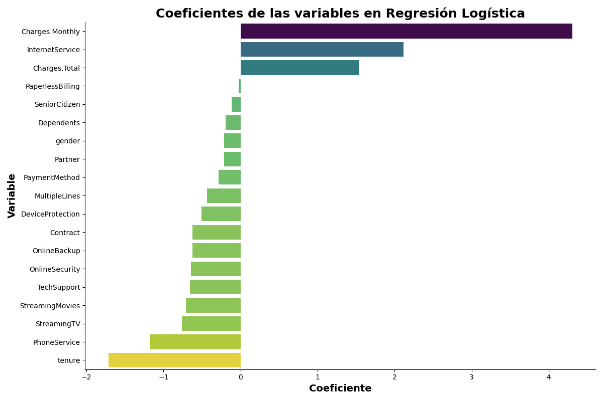

# 📊 **Análisis Predictivo de Cancelación de Clientes Telecom X**

¡Hola! Bienvenido/a a mi solución para el desafío de análisis predictivo cancelación de clientes en Telecom X, como parte de mi formación en Alura Latam.

 ## 🎯 **Propósito del Análisis**
 
 El objetivo principal de este proyecto es *predecir la cancelación de clientes (churn)* en la empresa de telecomunicaciones Telecom X,
 mediante el uso de *modelos de Machine Learning*. Se busca identificar las variables más relevantes que influyen en la decisión de un 
 cliente de irse, para que la empresa pueda implementar estrategias de retención proactivas y efectivas. 
 El análisis se enfoca en traducir datos en insights accionables para la toma de decisiones estratégicas.

## 📂 **Estructura y Organización del Proyecto**

El proyecto está organizado para facilitar su uso y comprensión. 
El repositorio contiene los siguientes archivos y directorios:
* `TelecomX_P2.ipynb`: El cuaderno principal de Jupyter donde se realizó todo el análisis,desde la preparación de datos
                       hasta la modelización y evaluación.
* `README.md`: Este archivo, que proporciona una descripción completa del proyecto.
* `Datos Tratados/`: Una carpeta que contiene el archivo CSV con los datos limpios y listos para ser utilizados.
                     [Enlace al archivo de datos tratados](Datos%20Tratados/datos_tratados.csv)

## 💻 ** Proceso de Preparación de Datos**

El proceso de preparación de los datos fue una etapa crítica para asegurar la calidad de los modelos. Los pasos principales fueron:

  * **Clasificación de Variables**:
         Se clasificaron las variables en categóricas y numéricas para aplicar el tratamiento adecuado en cada caso.

  * **Codificación**: 
         Las variables categóricas se convirtieron a formato numérico (encoding) para que los modelos de Machine Learning pudieran procesarlas.

  * **Separación de Datos**: 
         El conjunto de datos se dividió en conjuntos de entrenamiento y prueba (80/20) para evaluar el rendimiento de los modelos en datos no vistos.

  * **Normalización/Estandarización**:
         Se aplicó la estandarización a las variables numéricas, lo cual es fundamental para modelos como la Regresión Logística, que son sensibles a la escala de los datos.

  * **Balanceo de Clases**: 
         Se utilizó la técnica SMOTE para balancear la clase minoritaria (clientes que cancelaron). 
         Esto fue vital para evitar que el modelo se sesgara y para mejorar la detección de la cancelación.

## 📈 ** Gráficos e Insights Clave**

Durante el análisis exploratorio, se generaron varios gráficos que proporcionaron información valiosa:

  * **Matrices de Confusión**: 
         Muestran el rendimiento de cada modelo, destacando que la Regresión Logística fue la más efectiva para minimizar los Falsos Negativos (clientes que cancelarían pero no fueron predichos). 

  * **Importancia de las Variables**:
         Los gráficos de importancia de variables, generados por los modelos de Random Forest y Regresión Logística, revelaron que los factores clave de la cancelación son los cargos mensuales y totales, la duración del contrato y el tipo de servicio de Internet.
  

## 🚀 ** Instrucciones para Ejecutar el Cuaderno**

Para replicar el análisis, sigue estos pasos:

🐍 * **Entorno**:
    Se recomienda usar Google Colab o un entorno de Jupyter Notebook.

* **Instalar Bibliotecas**:
    Asegúrate de tener instaladas las bibliotecas necesarias:
✔️ *pandas,
📈 *scikit -learn
✔️ *matplotlib,
📊 *seaborn y
✔️ *imbalanced-learn.

* **Cargar los Datos**:
    Descarga el archivo de datos tratados (datos_tratados.csv) y cárgalo en tu entorno de trabajo.

* **Ejecutar el Cuaderno**:
    Simplemente ejecuta cada celda del cuaderno TelecomX_P2.ipynb en orden.
  

✨ **Autor:** Victoria Godoy - Analista Junior Machine Learning**
   **Fecha de Última Actualización:** 16 de Agosto de 2025  
 
